# Analizador Sintáctico Completo

Este programa está basado en un autómata de estados.
Los tokens que acepta son las siguientes:
* **identificadores = letra(letra|digito)***
* **Real = entero.entero+**
* **Real= entero.entero**
* **Operador de adición: + | -**
* **Operador de multiplicación: * | /**
* **Operador de asignación: =**
* **Operador relacional: < | > | <= | >= | != | ==**
* **Operador And: &&**
* **Operador Or: ||**
* **Operador Not: !**
* **Parentesis: ( , )**
* **Llave: { , }**
* **Punto y coma: ;**

* Además de las siguientes palabras reservadas: **if, while, return, else, int, float**
## Funciones

### EsLetra
Esta función retorna *true* si el caracter analizado corresponde a una letra

### EsDigito
Esta función retorna *true* si el caracter analizado corresponde a un dígito

### AutomataLexico
Esta función recibe una cadena y la analiza.
Está basada en el siguiente autómata:

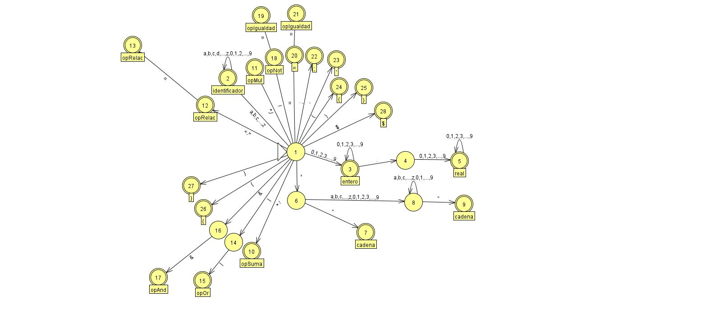

Donde:
* Cada estado está dentro de una sentencia switch
* Si al final del switch no se encuentra en un estado de aceptación, retorna error -1
* Dependiendo del estado de aceptación retorna un valor *entero*
* Imprime en pantalla el tipo de Símbolo identificado
* Imprime en pantalla el estado donde se quedó de ocurrir un error.

#### Tabla de valores a retornar (La columna *Tipo* es el entero que retorna)

| Símbolo       | Tipo          |       |
| ------------- |:-------------:| -----:|
| Identificador | 0             |       |
| Entero        | 1             |       |
| Real          | 2             |       |
| Cadena        | 3             |       |
| Tipo          | 4             | int,float,void       |
| opSuma        | 5             | +,-      |
| opMul         | 6             | *,/      |
| opRelac       | 7             | <,>,<=,>=      |
| opOr        | 8             |   &#124; &#124;  |
| opAnd        | 9             |   &&    |
| opNot        | 10             |    !   |
| opIgualdad        | 11             |  ==,!=     |
|;        | 12             |       |
|'        | 13             |       |
| (        | 14             |       |
| )        | 15             |       |
| {        | 16            |       |
| }        | 17            |       |
| =        | 18            |       |
| if        | 19            |       |
| while        | 20            |       |
| return        | 21            |       |
| else        | 22            |       |
| $        | 23            |       |

## Implementación del analizador sintáctico
Para el analizador sintáctico se utilizó gramáticas LR en si se trata de un archivo que contiene una matriz\
el programa carga la informacion de esa matriz en un arreglo bidimensional.\
Ademas se agrego un clase llamada Pila, la cual el programa utiliza para que de acuerdo al Token leido por\
el analizador lexico y la informacion de la matriz se agreguen objetos a esa pila o se retiren.\
Los objetos que acepta esa pila son los siguientes:

### Elemento pila
Esta es la clase padre, no contiene nada pero sirve de plantilla para los hijos de esta clase
### No Terminal
Esta clase es hija de la clase Elemento pila, contiene punteros al siguiente elemento del arbol
### Terminal 
Esta clase es hija de la clase Elemento pila, contiene el token recuperado
### Estado
Esta clase es hija de la clase Elemento pila, contiene la informacion que se utilizara para encontrar la fila, columna en la matriz.\

### Clase Nodo
Esta clase es la clase padre que sirve como base para los objetos de las reglas gramaticales, en las cuales se guarda la informacion recuperada de cada gramatica.

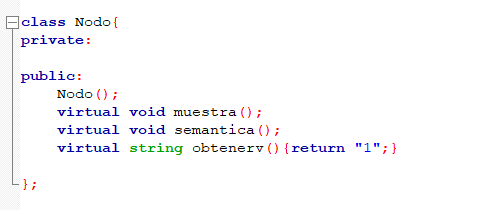
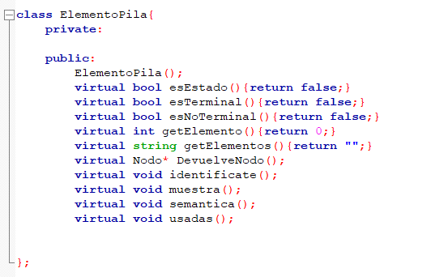
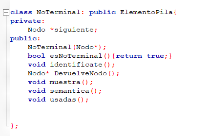
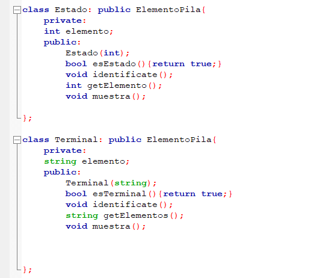

## Gramatica compilador
Las gramaticas que acepta el programa son las siguientes:\
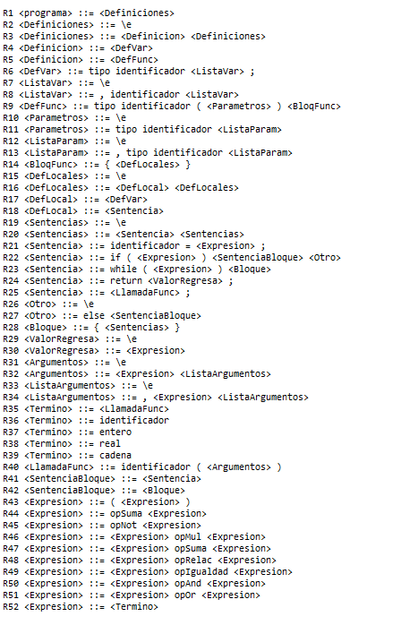

#### Ejemplo de salida
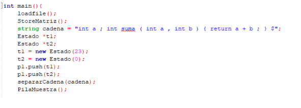\
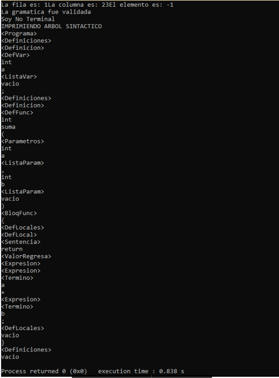\
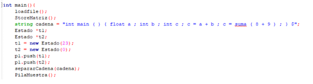\
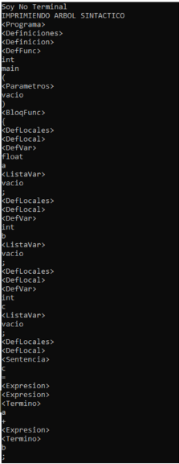\
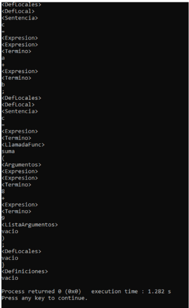\

