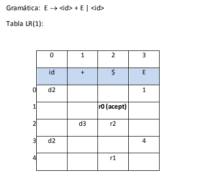

# Mini analizador Sintáctico

Se añadieron 2 funciones
* AnalizadorSintactico
* StoreMatriz

La primera es el funcionamiento del mini analizador sintáctico
La segunda solo se encaarga de llenar la matriz a utilizar

## Capturas de funciones
### AnalizadorSintactico

### StoreMatriz

## Funcionamiento

El programa utiliza tablas LR y una pila, en si es un ciclo while infinito que se detiene cuando se valida
la gramática. En cada vuelta del ciclo se obtiene un elemento de la matriz y verifica si es positivo (para
añadir elementos a la pila) o negativo (Para relizar las reducciones).

En cada reducción se quitan los elementos de la gramática multiplicados por 2

## Tablas LR

## Pruebas de funcionamiento

