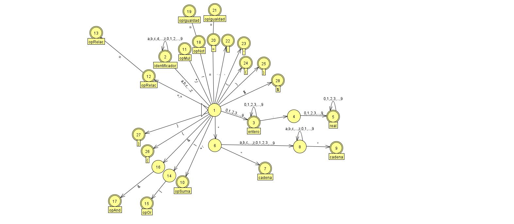
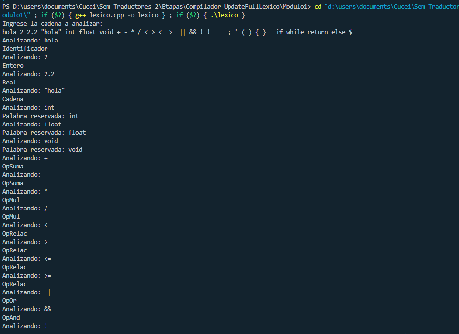
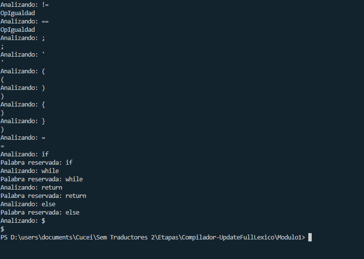

# Analizador Léxico Completo

Este programa está basado en un autómata de estados.
Las gramáticas que acepta son las siguientes:
* **identificadores = letra(letra|digito)***
* **Real = entero.entero+**
* **Real= entero.entero**
* **Operador de adición: + | -**
* **Operador de multiplicación: * | /**
* **Operador de asignación: =**
* **Operador relacional: < | > | <= | >= | != | ==**
* **Operador And: &&**
* **Operador Or: ||**
* **Operador Not: !**
* **Parentesis: ( , )**
* **Llave: { , }**
* **Punto y coma: ;**

* Además de las siguientes palabras reservadas: **if, while, return, else, int, float**
## Funciones

### EsLetra
Esta función retorna *true* si el caracter analizado corresponde a una letra

### EsDigito
Esta función retorna *true* si el caracter analizado corresponde a un dígito

### AutomataLexico
Esta función recibe una cadena y la analiza.
Está basada en el siguiente autómata:

Donde:
* Cada estado está dentro de una sentencia switch
* Si al final del switch no se encuentra en un estado de aceptación, retorna error -1
* Dependiendo del estado de aceptación retorna un valor *entero*
* Imprime en pantalla el tipo de Símbolo identificado
* Imprime en pantalla el estado donde se quedó de ocurrir un error.

#### Tabla de valores a retornar (La columna *Tipo* es el entero que retorna)

| Símbolo       | Tipo          |       |
| ------------- |:-------------:| -----:|
| Identificador | 0             |       |
| Entero        | 1             |       |
| Real          | 2             |       |
| Cadena        | 3             |       |
| Tipo          | 4             | int,float,void       |
| opSuma        | 5             | +,-      |
| opMul         | 6             | *,/      |
| opRelac       | 7             | <,>,<=,>=      |
| opOr        | 8             |   &#124; &#124;  |
| opAnd        | 9             |   &&    |
| opNot        | 10             |    !   |
| opIgualdad        | 11             |  ==,!=     |
|;        | 12             |       |
|'        | 13             |       |
| (        | 14             |       |
| )        | 15             |       |
| {        | 16            |       |
| }        | 17            |       |
| =        | 18            |       |
| if        | 19            |       |
| while        | 20            |       |
| return        | 21            |       |
| else        | 22            |       |
| $        | 23            |       |

#### Ejemplo de salida

